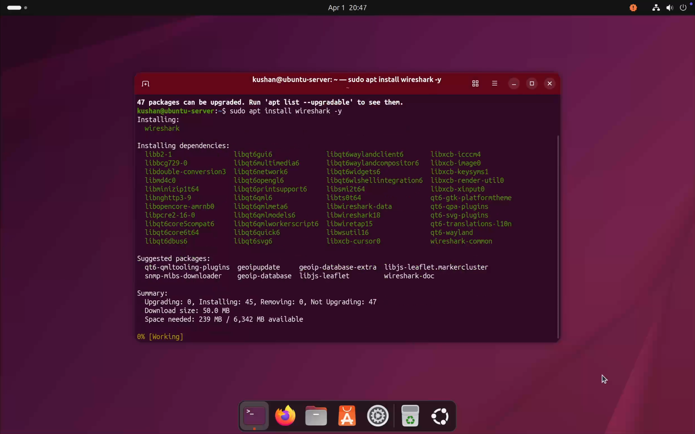
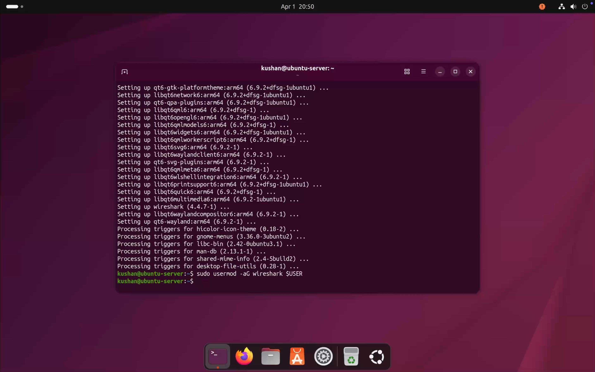
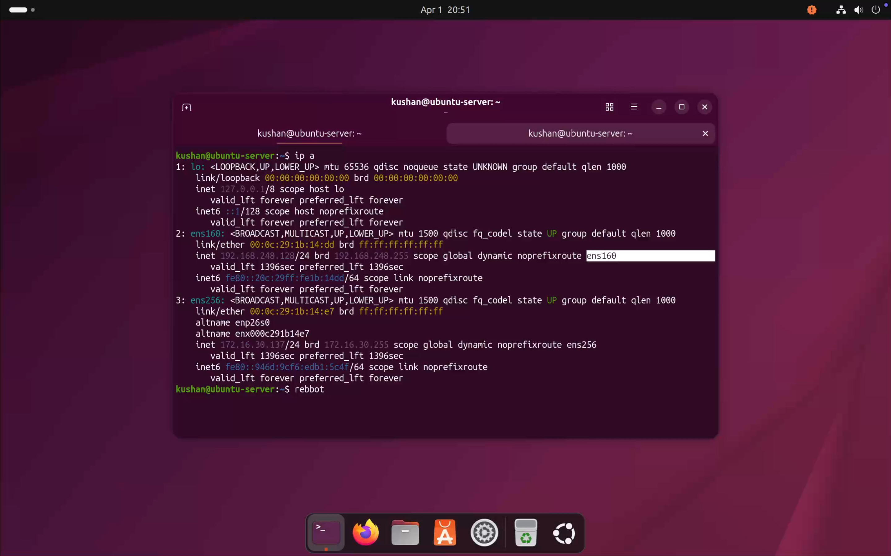
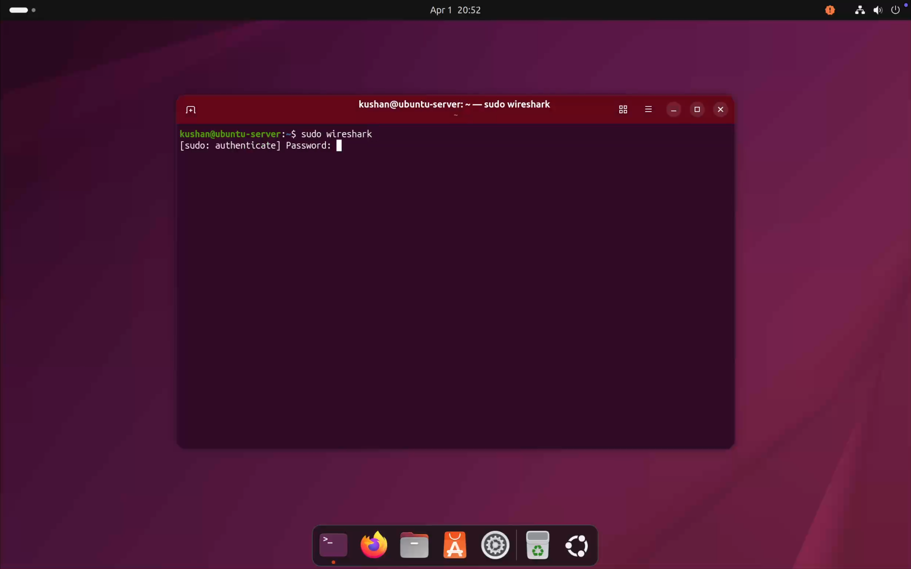
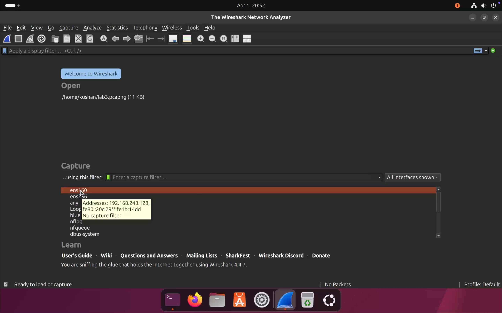
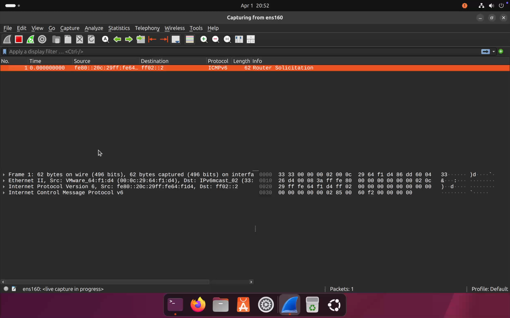
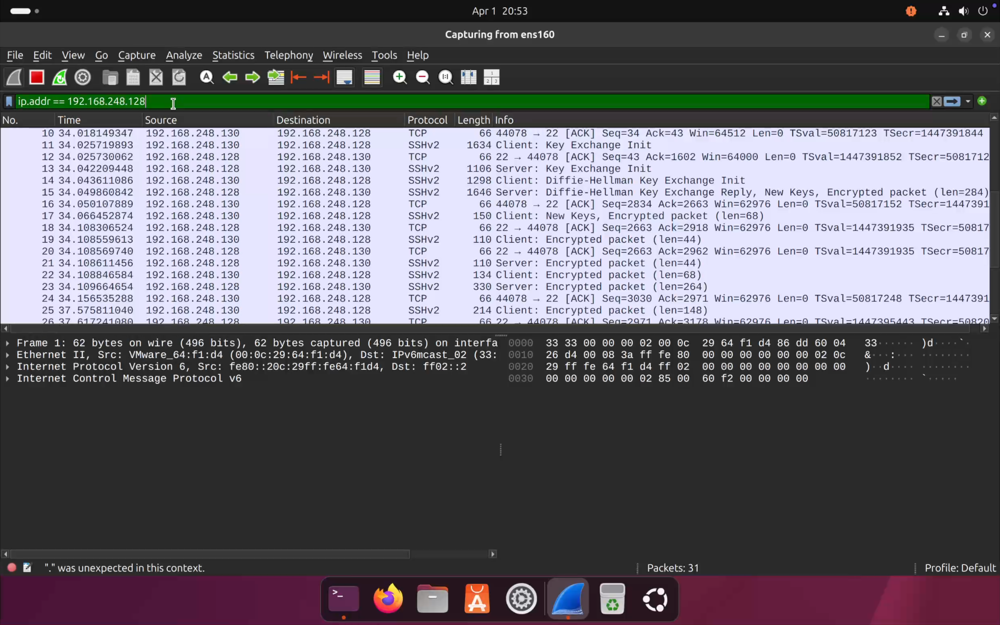

# 🟣 Lab 3: Network Traffic Analysis using Wireshark

> *Capture and analyze SSH network traffic between Kali Linux and an Ubuntu Server using Wireshark — observing TCP handshakes, SSH key exchange, and encrypted sessions in real time.*

---

## 📋 Table of Contents

- [Objective](#-objective)
- [Lab Environment](#-lab-environment)
- [Tools Used](#️-tools-used)
- [Scenario Overview](#-scenario-overview)
- [Lab Steps](#-lab-steps)
  - [1. Install Wireshark](#1️⃣-install-wireshark)
  - [2. Add User to Wireshark Group](#2️⃣-add-user-to-wireshark-group)
  - [3. Reboot System](#3️⃣-reboot-system)
  - [4. Identify Network Interface](#4️⃣-identify-network-interface)
  - [5. Start Wireshark](#5️⃣-start-wireshark)
  - [6. Start Packet Capture](#6️⃣-start-packet-capture)
  - [7. Generate SSH Traffic](#7️⃣-generate-ssh-traffic)
  - [8. Apply Filters](#8️⃣-apply-filters)
  - [9. Packet Analysis](#9️⃣-packet-analysis)
- [Observations](#-observations)
- [Important Insight](#️-important-insight)
- [Attack Flow](#-attack-flow)
- [Skills Demonstrated](#-skills-demonstrated)
- [Key Learnings](#-key-learnings)
- [Conclusion](#-conclusion)

---

## 🎯 Objective

Capture and analyze SSH network traffic between **Kali Linux** (attacker) and **Ubuntu Server** (target) using **Wireshark** — understanding how secure communication behaves at the packet level, including TCP handshakes, SSH key exchange, and traffic encryption.

---

## 🧱 Lab Environment

| Setting | Details |
|---------|---------|
| Hypervisor | VMware Fusion |

### 🖥️ Machines

| Role | OS | IP Address |
|------|----|-----------|
| 🔴 Attacker | Kali Linux | `192.168.248.130` |
| 🟢 Target | Ubuntu Server | `192.168.248.128` |

---

## 🛠️ Tools Used

| Tool | Purpose |
|------|---------|
| **Wireshark** | Packet capture and traffic analysis |
| **OpenSSH** | Generate SSH traffic between machines |
| **Kali Linux Terminal** | Initiate SSH connections |

---

## 🚨 Scenario Overview

```
[Kali Linux] ──── SSH Connection ────▶ [Ubuntu Server]
                                               │
                                          Wireshark
                                        (ens160 interface)
                                               │
                                    Capture & Analyze Packets
                                    TCP Handshake · Key Exchange
                                      Encrypted SSH Sessions
```

- Wireshark installed on **Ubuntu Server** to capture traffic
- SSH connections initiated from **Kali Linux** to generate traffic
- Captured packets analyzed to understand communication behavior and encryption

---

## ⚙️ Lab Steps

---

### 1️⃣ Install Wireshark

Wireshark was installed on the Ubuntu Server.

```bash
sudo apt update
sudo apt install wireshark -y
```

> 💡 During installation, selected **YES** to allow non-root users to capture packets.



---

### 2️⃣ Add User to Wireshark Group

The current user was added to the `wireshark` group to enable packet capture without root privileges.

```bash
sudo usermod -aG wireshark $USER
```



---

### 3️⃣ Reboot System

A system reboot was performed to apply the group permission changes.

```bash
sudo reboot
```

> ⚠️ This step is required — group membership changes do not take effect until the session is restarted.

---

### 4️⃣ Identify Network Interface

The correct network interface for the lab network was identified.

```bash
ip a
```

| Interface | IP Address | Network |
|-----------|-----------|---------|
| `ens160` | `192.168.248.128` | ✅ Lab network (Host-only) |
| `ens256` | `172.16.30.137` | NAT network |

**Selected interface:** `ens160`



---

### 5️⃣ Start Wireshark

Wireshark was launched on Ubuntu.

```bash
sudo wireshark
```



---

### 6️⃣ Start Packet Capture

The `ens160` interface was selected in Wireshark and packet capture was started.





---

### 7️⃣ Generate SSH Traffic

SSH connections were initiated from Kali Linux to the Ubuntu Server to produce live traffic for analysis.

```bash
ssh testuser@192.168.248.128
```

#### Actions performed:
- Multiple **failed** login attempts
- One **successful** login


---

### 8️⃣ Apply Filters

Wireshark display filters were applied to isolate relevant SSH traffic.

#### Filter by IP address:
```
ip.addr == 192.168.248.128
```

#### Filter by protocol:
```
ssh
```



---

### 9️⃣ Packet Analysis

The captured traffic revealed several distinct phases of the SSH communication:

#### 🤝 TCP Handshake
```
SYN  →
     ← SYN-ACK
ACK  →
```
Standard 3-way handshake establishing the TCP connection before SSH begins.

---

#### 🔐 SSH Protocol Banner
```
SSH-2.0-OpenSSH
```
Both client and server exchange protocol version banners.

---

#### 🔑 Key Exchange
| Phase | Description |
|-------|-------------|
| Client Key Exchange Init | Client proposes supported algorithms |
| Server Key Exchange Init | Server responds with chosen algorithms |
| Diffie-Hellman Exchange | Shared secret established securely |

---

#### 🔒 Encrypted Traffic
After the handshake and key exchange, all subsequent packets appear as:
```
Encrypted packet
```
No plaintext credentials or session data are visible.


---

## 🔍 Observations

| Observation | Detail |
|-------------|--------|
| SSH Port | TCP Port `22` |
| Source IP | `192.168.248.130` (Kali — Attacker) |
| Destination IP | `192.168.248.128` (Ubuntu — Target) |
| Connection Attempts | Multiple attempts observed |
| Post-Handshake Traffic | Fully encrypted |

---

## ⚠️ Important Insight

> **Wireshark cannot display passwords or session content during SSH communication** — all data is encrypted after the handshake phase using keys established via Diffie-Hellman exchange.
>
> However, **connection patterns**, **repeated attempts**, and **source/destination metadata** remain visible and can still be used for detection and analysis.

---

## 🧪 Attack Flow

```
 1. Install Wireshark on Ubuntu
 2. Add user to wireshark group
 3. Reboot to apply permissions
 4. Identify correct interface (ens160)
 5. Launch Wireshark & start capture
 6. Generate SSH traffic from Kali ──▶ Ubuntu
 7. Apply display filters (ip.addr / ssh)
 8. Analyze packets:
        ├── TCP 3-way handshake
        ├── SSH protocol banner exchange
        ├── Diffie-Hellman key exchange
        └── Encrypted session traffic
```

---

## 🧠 Skills Demonstrated

- ✅ Installing and configuring Wireshark on Linux
- ✅ Network interface identification and selection
- ✅ Live packet capture and display filtering
- ✅ TCP handshake analysis
- ✅ SSH protocol and key exchange understanding
- ✅ Recognizing encrypted vs. plaintext traffic patterns
- ✅ Network-level monitoring from a defender perspective

---

## 📘 Key Learnings

- ✅ Selecting the correct network interface is critical for capturing relevant traffic
- ✅ SSH encrypts all session data after the key exchange — credentials are never exposed in packets
- ✅ Network metadata (IPs, ports, timing) remains visible even within encrypted sessions
- ✅ Wireshark is a powerful tool for both troubleshooting and security monitoring
- ✅ Traffic analysis can reveal communication patterns useful for intrusion detection

---

## 🚀 Conclusion

This lab demonstrated how to capture and analyze live SSH traffic using Wireshark, providing a clear view of the TCP handshake, SSH protocol negotiation, and Diffie-Hellman key exchange before the session becomes fully encrypted. It reinforced the importance of network traffic analysis as a core skill for security monitoring and incident response.

---

## ⚠️ Disclaimer

> This lab was conducted in a **controlled virtual environment** for **educational purposes only**.  
> Do not replicate these techniques on any network or system without explicit written authorization.

---

<div align="center">

*🟣 Lab 3 — Network Traffic Analysis with Wireshark · Cybersecurity Home Lab Series*

</div>
